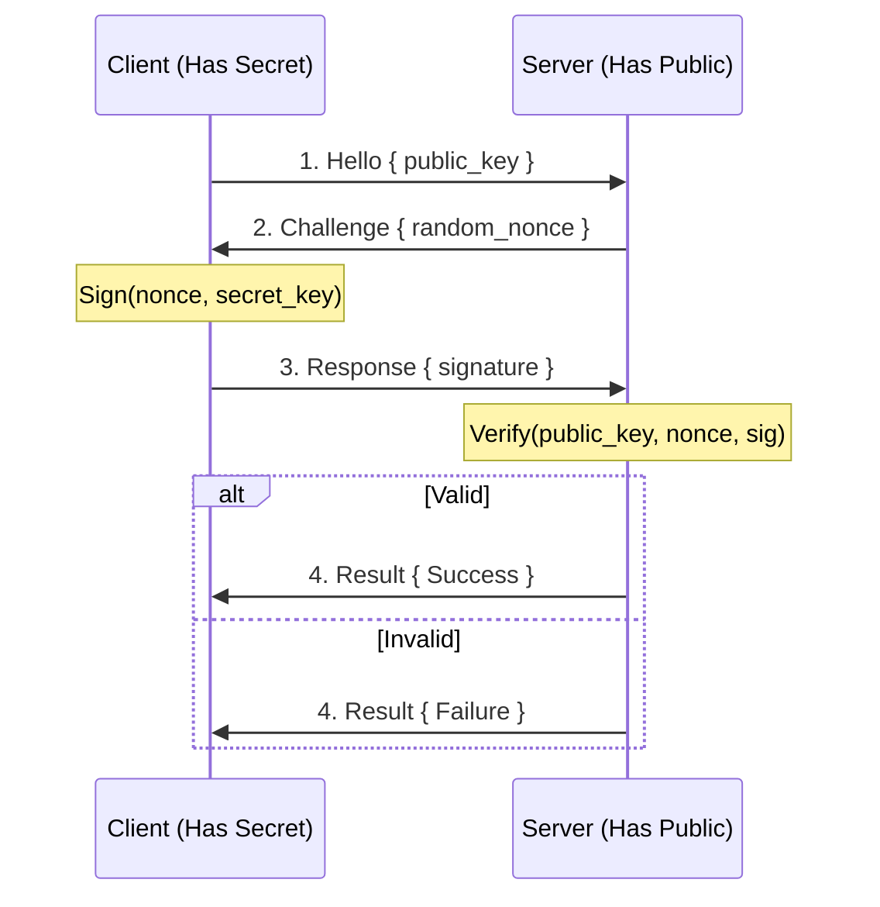

# ALICE-Auth

**Cryptographic Authentication for the ALICE Ecosystem**

> "Don't send secrets. Send proofs."

## Why ALICE-Auth?

Traditional authentication relies on servers knowing your secrets. ALICE-Auth replaces trust with mathematics.

| Aspect | Legacy Auth (OAuth/Password) | ALICE-Auth (Math) |
|--------|------------------------------|-------------------|
| **Trust Basis** | Server (Google/Auth0) | **Mathematics (Ed25519/ZKP)** |
| **Proof Method** | Send password | **Zero-Knowledge Proof** |
| **Leak Risk** | DB breach = game over | **Private key never leaves device** |
| **Control** | Corporation (can BAN) | **User (cannot be BAN'd)** |

ALICE-Auth uses **Ed25519 elliptic curve cryptography** to prove identity without revealing secrets.

## How It Works



**Key insight**: The server never learns your secret key. It only verifies a mathematical proof.

## Installation

```toml
[dependencies]
alice-auth = { version = "0.4", default-features = false }
```

## Quick Start

### Generate Identity (First Launch)

```rust
use alice_auth::Identity;

// Generate new identity (do this once, store the seed securely)
// In a real app, save `seed` to encrypted storage.
let identity = Identity::gen()?;

// Your public ID (safe to share)
println!("Your ID: {}", identity.id());
// Output: alice://did:ed25519:7f8a3b...

// Backup seed (store securely!)
let seed = identity.seed();
```

### Authenticate (Client Side)

```rust
use alice_auth::{Identity, hello, respond, Challenge};

let identity = Identity::from_seed(&saved_seed);

// 1. Send hello
let h = hello(&identity);
network.send(h);

// 2. Receive challenge from server
let c: Challenge = network.receive();

// 3. Sign and respond
let r = respond(&identity, &c);
network.send(r);
```

### Verify (Server Side)

```rust
use alice_auth::{make_challenge, check, AuthResult, Hello, Response};

// 1. Receive hello, send challenge
let h: Hello = network.receive();
let pending = make_challenge(h.id)?;
network.send(Challenge { n: pending.c });

// 2. Receive response, verify
let r: Response = network.receive();
match check(&pending, &r) {
    AuthResult::Ok(session_id) => {
        println!("Authenticated! Session: {:?}", session_id);
    }
    AuthResult::Fail => {
        println!("Authentication failed.");
        disconnect();
    }
}
```

## Unity (C#) Integration

Build the library as a native plugin:

```bash
cargo build --release --features ffi
# Output:
#   macOS: target/release/libalice_auth.dylib
#   Windows: target/release/alice_auth.dll
#   Linux: target/release/libalice_auth.so
```

C# bindings (Deep Fried):

```csharp
using System;
using System.Runtime.InteropServices;

public class AliceAuth : IDisposable
{
    [DllImport("alice_auth")] private static extern IntPtr aa_new();
    [DllImport("alice_auth")] private static extern void aa_id(IntPtr h, byte[] o);
    [DllImport("alice_auth")] private static extern void aa_sign(IntPtr h, byte[] c, byte[] o);
    [DllImport("alice_auth")] private static extern int aa_verify(byte[] pk, byte[] m, UIntPtr l, byte[] s);
    [DllImport("alice_auth")] private static extern void aa_free(IntPtr h);

    private IntPtr _h;
    public AliceAuth() { _h = aa_new(); }

    public byte[] Id() {
        var b = new byte[32]; aa_id(_h, b); return b;
    }

    public byte[] Sign(byte[] c) {
        var s = new byte[64]; aa_sign(_h, c, s); return s;
    }

    public static bool Verify(byte[] pk, byte[] msg, byte[] sig) =>
        aa_verify(pk, msg, (UIntPtr)msg.Length, sig) == 1;

    public void Dispose() {
        if (_h != IntPtr.Zero) { aa_free(_h); _h = IntPtr.Zero; }
    }
    ~AliceAuth() => Dispose();
}
```

## ALICE-API Integration

ALICE-Auth integrates directly into [ALICE-API](../ALICE-API) as an optional middleware layer.

```toml
[dependencies]
alice-api = { version = "0.1", features = ["auth"] }
```

```rust
use alice_api::prelude::*;

// Client: create auth context from identity
let identity = alice_auth::Identity::gen().unwrap();
let sign_msg = b"GET /api/users";
let auth = AuthContext::new(
    identity.id().into_bytes(),
    identity.sign(sign_msg).into_bytes(),
);

// Gateway: verify inline (after rate limiting, before forwarding)
if auth.verify(sign_msg) {
    // Forward to backend
}
```

With `features = ["secure"]`, ALICE-API provides `SecureGateway` which combines GCRA rate limiting + Ed25519 auth + XChaCha20-Poly1305 encryption in a single pipeline.

## Cross-Crate Bridges

### Crypto Bridge (feature: `crypto`)

Hardware-backed cryptographic token signing and verification via [ALICE-Crypto](../ALICE-Crypto). When enabled, authentication tokens are signed and verified using ALICE-Crypto's XChaCha20-Poly1305 and BLAKE3 primitives, providing stronger token integrity than standalone Ed25519 signatures.

```toml
[dependencies]
alice-auth = { version = "0.4", features = ["crypto"] }
```

### ALICE-DB Bridge (feature: `db`)

Authentication audit log persistence with time-range queries.

- `AuthAuditLog` — 43-byte binary serialization (identity_hash, timestamp, action, success, zkp_verified)
- `AuthDbStore` — Store/query audit logs by identity and time range
- `count_failed_attempts()` — Failed auth counting for rate limiting

Enable: `alice-auth = { features = ["db"] }`

### ALICE-API Bridge (feature: `api`)

Zero-trust middleware for request verification.

- `AuthMiddleware` — Ed25519 signature verification + sliding window rate limiter
- `AuthRequest` / `AuthResponse` — Token + signature verification flow
- `create_auth_token()` — Time-limited auth token generation
- `validate_rate_limit()` — Per-identity sliding window rate limiting

Enable: `alice-auth = { features = ["api"] }`

### Build Profile Changes

- `[profile.bench]`: Standardized bench profile added

## Security Properties

### Zero-Knowledge Proof

The server learns **nothing** about your secret key from the authentication exchange. It only learns that you possess a key that matches the public key.

### Trustless P2P

In ALICE-Sync networks, every packet can be signed. Even if your neighbor node is malicious, they cannot:

- **Impersonate you** (without your secret key)
- **Tamper with your messages** (signature would be invalid)
- **Replay old messages** (nonce prevents replay)

### BAN Resistance

Your identity `alice://did:ed25519:...` is mathematically yours. If a world bans you:

- Your assets/avatar data are signed by your key.
- You can migrate to another P2P node with full ownership.
- No corporation can "delete" your identity.

## License

**GNU AGPLv3** (Affero General Public License v3.0)

This program is free software: you can redistribute it and/or modify it under the terms of the GNU Affero General Public License as published by the Free Software Foundation, either version 3 of the License, or (at your option) any later version.

**Why AGPL?** This license ensures that if any entity (e.g., cloud providers) runs ALICE-Auth as a service over a network, they must release their modifications to the source code. This protects the ALICE ecosystem from proprietary embrace-and-extend tactics.

Commercial licensing is available for enterprise use cases where source code disclosure is not possible.

**For commercial inquiries, please contact: https://extoria.co.jp/en**

## Author

Moroya Sakamoto

---

*"Your identity belongs to mathematics, not corporations."*
