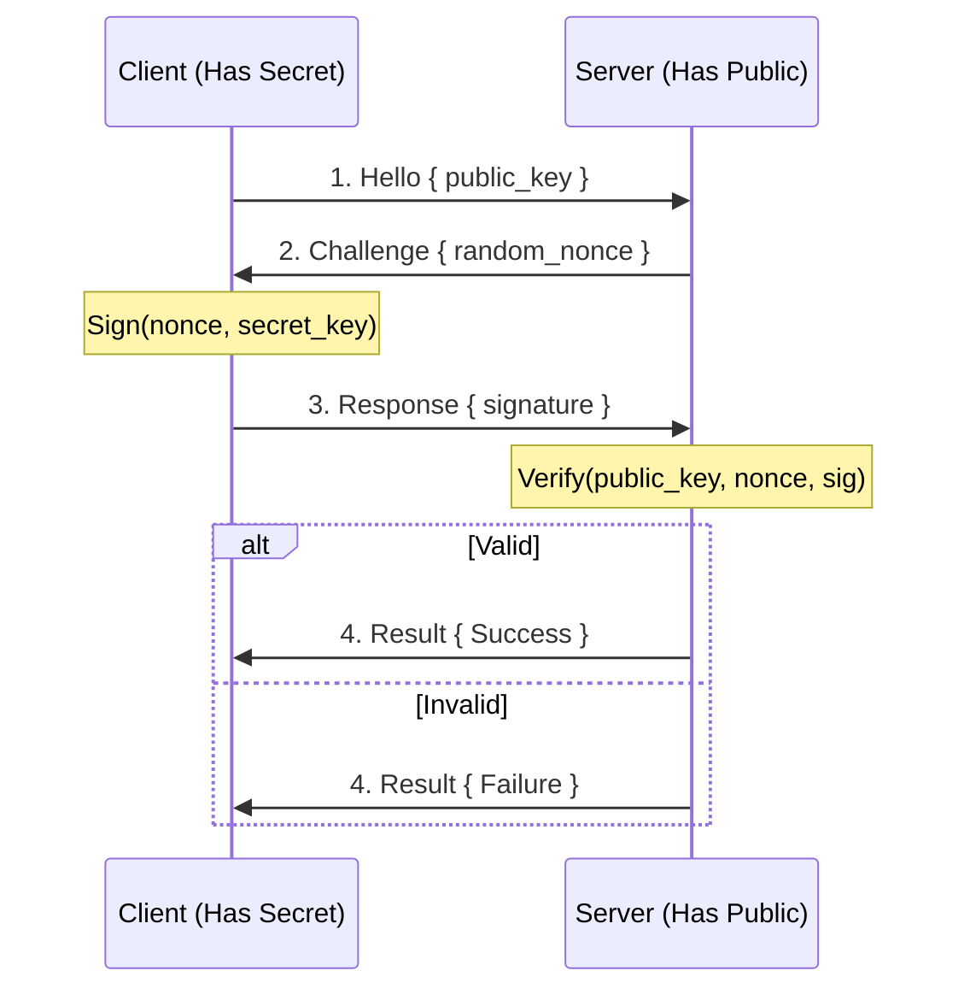

# ALICE-Auth

**Cryptographic Authentication for the ALICE Ecosystem**

> "Don't send secrets. Send proofs."

## Why ALICE-Auth?

Traditional authentication relies on servers knowing your secrets. ALICE-Auth replaces trust with mathematics.

| Aspect | Legacy Auth (OAuth/Password) | ALICE-Auth (Math) |
|--------|------------------------------|-------------------|
| **Trust Basis** | Server (Google/Auth0) | **Mathematics (Ed25519 + Schnorr NIZK)** |
| **Proof Method** | Send password | **Cryptographic Proof (signature / ZKP)** |
| **Leak Risk** | DB breach = game over | **Private key never leaves device** |
| **Recovery** | "Forgot password" email | **Shamir SSS + Social Recovery** |
| **Control** | Corporation (can BAN) | **User (cannot be BAN'd)** |

ALICE-Auth uses **Ed25519 elliptic curve cryptography** with an optional **Schnorr NIZK (Non-Interactive Zero-Knowledge Proof)** to prove identity without revealing secrets.

## How It Works


```mermaid
sequenceDiagram
    participant Client as Client (Has Secret)
    participant Server as Server (Has Public)

    Client->>Server: 1. Hello { public_key }
    Server->>Client: 2. Challenge { random_nonce }
    Note over Client: Sign(nonce, secret_key)
    Client->>Server: 3. Response { signature }
    Note over Server: Verify(public_key, nonce, sig)
    alt Valid
        Server->>Client: 4. Result { Success }
    else Invalid
        Server->>Client: 4. Result { Failure }
    end
```

**Key insight**: The server never learns your secret key. It only verifies a mathematical proof.

> **Note on ZKP**: The default challenge-response protocol uses standard Ed25519 signatures — a proven,
> battle-tested authentication method. For applications requiring a formal zero-knowledge guarantee
> (where even the _structure_ of the proof reveals nothing about the secret), enable the `nizk` feature
> for **Schnorr NIZK proofs** over Curve25519 with Fiat-Shamir transform.

## Installation

```toml
[dependencies]
alice-auth = "0.5"                    # includes std (default)
alice-auth = { version = "0.5", default-features = false }  # no_std (embedded/WASM)
```

## Testing

```bash
cargo test                                      # 62 tests (std default)
cargo test --features nizk,db,api,serde,ffi     # 145 tests (full suite)
cargo check --no-default-features               # verify no_std build
```

## Feature Flags

| Feature | Dependencies | Description |
|---------|-------------|-------------|
| `std` | `alloc`, `getrandom/std` | Standard library support |
| `crypto` | `alice-crypto`, `std` | BLAKE3 hashing, XChaCha20 encryption, Shamir SSS, HD key derivation |
| `nizk` | `curve25519-dalek`, `crypto`, `std` | Schnorr NIZK proof (true ZKP, Fiat-Shamir transform) |
| `db` | `std` | Self-contained BTreeMap audit log |
| `api` | `std` | API middleware, RBAC, session revocation, distributed rate limiting |
| `ffi` | `std` | C-ABI FFI — 28 functions (Unity / UE5 / any C-compatible language) |
| `pyo3` | `std` | Python bindings — 15 functions + 5 classes |
| `serde` | — | Serialization support for wire types |

## Quick Start

### Generate Identity (First Launch)

```rust
use alice_auth::Identity;

// Generate new identity (do this once, store the seed securely)
let identity = Identity::gen()?;

// Your public ID (safe to share)
println!("Your ID: {}", identity.id());
// Output: alice://did:ed25519:7f8a3b...

// Backup seed (store securely!)
let seed = identity.seed();
```

### Authenticate (Client Side)

```rust
use alice_auth::{Identity, hello, respond, Challenge};

let identity = Identity::from_seed(&saved_seed);

// 1. Send hello
let h = hello(&identity);
network.send(h);

// 2. Receive challenge from server
let c: Challenge = network.receive();

// 3. Sign and respond
let r = respond(&identity, &c);
network.send(r);
```

### Verify (Server Side)

```rust
use alice_auth::{make_challenge, check, AuthResult, Hello, Response};

// 1. Receive hello, send challenge
let h: Hello = network.receive();
let pending = make_challenge(h.id)?;
network.send(Challenge { n: pending.c });

// 2. Receive response, verify
let r: Response = network.receive();
match check(&pending, &r) {
    AuthResult::Ok(session_id) => {
        println!("Authenticated! Session: {:?}", session_id);
    }
    AuthResult::Fail => {
        println!("Authentication failed.");
        disconnect();
    }
}
```

## Engine Bindings

### Unity (C#)

Full wrapper: [`bindings/unity/AliceAuth.cs`](bindings/unity/AliceAuth.cs)

Build the native plugin (cdylib):

```bash
cargo rustc --release --features "ffi,nizk" --crate-type cdylib
# Output:
#   macOS:   target/release/libalice_auth.dylib
#   Windows: target/release/alice_auth.dll
#   Linux:   target/release/libalice_auth.so
```

Copy the library to `Assets/Plugins/` and use directly:

```csharp
using Alice.Auth;

// Generate identity (secret key stays in Rust memory)
using var id = new AliceIdentity();
byte[] publicKey = id.Id();      // 32 bytes
byte[] sig = id.Sign(challenge);  // 64 bytes

// Verify
bool ok = AliceIdentity.Verify(publicKey, message, sig);

// Schnorr NIZK (zero-knowledge proof)
byte[] proof = AliceNizk.Prove(id, message);
bool valid = AliceNizk.Verify(publicKey, message, proof);

// Key rotation (N-generation)
using var rotating = new AliceRotatingIdentity();
byte[] newId = rotating.Rotate(nowMs);
uint generations = rotating.GenerationCount;

// RBAC
using var policy = new AlicePolicyEngine();
policy.Assign(publicKey, (1 << AlicePolicyEngine.Read) | (1 << AlicePolicyEngine.Write));
bool canRead = policy.Check(publicKey, AlicePolicyEngine.Read);

// Trust chain endorsement
byte[] endorsement = AliceEndorsement.Endorse(id, targetId, nowMs, ttlMs);
bool trusted = AliceEndorsement.Verify(endorsement, nowMs);

// HD key derivation
using var child = AliceCrypto.DeriveChild(id, 0);
byte[] sessionKey = AliceCrypto.DeriveSessionKey(idA, idB, sharedSecret);
```

### UE5 (C++)

Full header: [`bindings/ue5/AliceAuth.h`](bindings/ue5/AliceAuth.h)

Link the library in your `Build.cs` and include the header:

```cpp
#include "AliceAuth.h"
using namespace AliceAuth;

// Generate identity (RAII, move-only)
FAliceIdentity Id;
uint8_t PublicKey[32];
Id.GetId(PublicKey);

// Sign & verify
uint8_t Sig[64];
Id.Sign(Challenge, Sig);
bool bOk = FAliceIdentity::Verify(PublicKey, Message, MessageLen, Sig);

// Schnorr NIZK
uint8_t Proof[64];
FAliceNizk::Prove(Id, Message, MessageLen, Proof);
bool bValid = FAliceNizk::Verify(PublicKey, Message, MessageLen, Proof);

// N-generation key rotation
FAliceRotatingIdentity Rotating;
uint8_t NewId[32];
Rotating.Rotate(NowMs, NewId);

// RBAC policy engine
FAlicePolicyEngine Policy;
Policy.Assign(PublicKey, (1 << FAlicePolicyEngine::Read) | (1 << FAlicePolicyEngine::Write));
bool bCanRead = Policy.Check(PublicKey, FAlicePolicyEngine::Read);

// Trust chain endorsement
uint8_t Endorsement[176];
FAliceEndorsement::Endorse(Id, TargetId, NowMs, TtlMs, Endorsement);
bool bTrusted = FAliceEndorsement::Verify(Endorsement, NowMs);

// HD key derivation
FAliceIdentity Child = FAliceCrypto::DeriveChild(Id, 0);
uint8_t SessionKey[32];
FAliceCrypto::DeriveSessionKey(IdA, IdB, Secret, SecretLen, SessionKey);
```

### Python

Install via maturin:

```bash
pip install maturin
maturin develop --features pyo3
```

```python
import alice_auth as aa

# Generate identity
identity = aa.Identity()
public_key = identity.id()       # bytes (32)
sig = identity.sign(challenge)    # bytes (64)
ok = aa.verify(public_key, message, sig)

# Schnorr NIZK
proof = aa.nizk_prove(identity, message)
valid = aa.nizk_verify(public_key, message, proof)

# N-generation key rotation
rotating = aa.RotatingIdentity()
new_id = rotating.rotate(now_ms)
gen_count = rotating.generation_count()

# RBAC
policy = aa.PolicyEngine()
policy.assign(public_key, 0b0011)  # Read + Write
can_read = policy.check(public_key, 0)

# Trust chain endorsement
endorsement = aa.endorse(identity, target_id, now_ms, ttl_ms)
trusted = aa.verify_endorsement(endorsement, now_ms)

# Auth token
token = aa.token_create(now_ms, ttl_ms)
expired = aa.token_is_expired(token, now_ms)

# Session revocation
revlist = aa.RevocationList()
revlist.revoke(token_bytes, now_ms)
is_revoked = revlist.is_revoked(token_bytes)

# HD key derivation
child = aa.derive_child(identity, 0)
```

## ALICE-API Integration

ALICE-Auth integrates directly into [ALICE-API](../ALICE-API) as an optional middleware layer.

```toml
[dependencies]
alice-api = { version = "0.1", features = ["auth"] }
```

```rust
use alice_api::prelude::*;

// Client: create auth context from identity
let identity = alice_auth::Identity::gen().unwrap();
let sign_msg = b"GET /api/users";
let auth = AuthContext::new(
    identity.id().into_bytes(),
    identity.sign(sign_msg).into_bytes(),
);

// Gateway: verify inline (after rate limiting, before forwarding)
if auth.verify(sign_msg) {
    // Forward to backend
}
```

With `features = ["secure"]`, ALICE-API provides `SecureGateway` which combines GCRA rate limiting + Ed25519 auth + XChaCha20-Poly1305 encryption in a single pipeline.

## Features

### Core (default, `no_std`)

Ed25519 challenge-response authentication with zero allocations.

### Schnorr NIZK Proof (feature: `nizk`)

True zero-knowledge proof using the Fiat-Shamir heuristic over Curve25519.

```rust
use alice_auth::nizk::{prove, verify_proof};

let identity = Identity::gen()?;
let proof = prove(&identity, b"login-context")?;
assert!(verify_proof(&identity.id(), b"login-context", &proof));
```

The proof reveals **zero information** about the secret key (simulator-indistinguishable).

### Key Rotation (feature: `std`)

`RotatingIdentity` maintains current + N previous keypairs with configurable generation limit. Old keys remain valid during a grace period for seamless key transitions.

```rust
use alice_auth::RotatingIdentity;

let mut rotating = RotatingIdentity::gen()?;
let new_id = rotating.rotate(now_ms)?;

// Verify against any generation (current or previous)
assert!(rotating.verify_any(&old_public_key, message, &signature));
```

### Trust Chain / Endorsement (feature: `std`)

Endorsement chain verification (root -> intermediate -> leaf) for hierarchical PKI with time-bound expiry.

```rust
use alice_auth::{endorse, verify_endorsement, verify_chain};

let endorsement = endorse(&root, &child.id(), now_ms, ttl_ms);
assert!(verify_endorsement(&endorsement, now_ms));
assert!(verify_chain(&[endorsement1, endorsement2], &root.id(), now_ms));
```

### Auth Token (feature: `api`)

Structured 17-byte authentication tokens with creation timestamp and TTL-based expiry.

### Session Revocation (feature: `api`)

Constant-time token blacklist with timestamped entries, max capacity, and auto-purge of expired entries.

```rust
use alice_auth::RevocationList;

let mut revlist = RevocationList::new();
revlist.revoke(&token, now_ms);
assert!(revlist.is_revoked(&token));

// Purge entries older than ttl_ms
let purged = revlist.auto_purge(now_ms, ttl_ms);
```

### RBAC (feature: `api`)

Bitmask-based role/permission system (Read, Write, Admin, Execute) with per-identity policy engine.

### Seed Recovery (feature: `crypto`)

Split an identity seed into K-of-N Shamir shards. Any K shards reconstruct the original identity.

```rust
use alice_auth::crypto_bridge::{split_seed, recover_identity};

let shards = split_seed(&identity, 5, 3)?;
// Distribute: phone, USB key, trusted friend, safe, lawyer
let recovered = recover_identity(&[shards[0].clone(), shards[2].clone(), shards[4].clone()])?;
assert_eq!(recovered.id(), identity.id());
```

### HD Key Derivation (feature: `crypto`)

Derive child identities from a master seed. One backup recovers all children.

```rust
use alice_auth::crypto_bridge::derive_child;

let auth_key = derive_child(&master, 0);  // authentication
let sign_key = derive_child(&master, 1);  // document signing
let enc_key  = derive_child(&master, 2);  // encryption
```

### Session Key Derivation (feature: `crypto`)

Derive a shared session key from two identities and a shared secret using BLAKE3 hash normalization.

```rust
use alice_auth::crypto_bridge::derive_session_key;

let session_key = derive_session_key(&id_a, &id_b, &shared_secret);
```

### Social Recovery (feature: `std`)

Guardian-based key migration. A threshold of trusted guardians can authorize migrating to a new identity.

```rust
use alice_auth::{RecoveryConfig, approve_recovery, validate_recovery};

let config = RecoveryConfig { guardians: vec![g1.id(), g2.id(), g3.id()], threshold: 2 };
let approval1 = approve_recovery(&g1, &old_id, &new_id, now_ms);
let approval2 = approve_recovery(&g2, &old_id, &new_id, now_ms);
assert!(validate_recovery(&config, &old_id, &new_id, &[approval1, approval2]));
```

### Challenge TTL (feature: `std`)

Time-limited nonce challenges (default 30s) prevent stale challenge replay.

### Distributed Rate Limiting (feature: `api`)

Exportable/importable/mergeable rate limit state for multi-node deployments.

## Cross-Crate Bridges

### Crypto Bridge (feature: `crypto`)

BLAKE3 token hashing, XChaCha20-Poly1305 session encryption, Shamir SSS seed recovery, and HD key derivation via [ALICE-Crypto](../ALICE-Crypto).

```toml
[dependencies]
alice-auth = { version = "0.5", features = ["crypto"] }
```

### ALICE-DB Bridge (feature: `db`)

Self-contained authentication audit log with BTreeMap-backed time-range queries.

- `AuthAuditLog` — 43-byte binary serialization (identity_hash, timestamp, action, success, zkp_verified)
- `AuthDbStore` — Store/query audit logs by identity and time range
- `count_failed_attempts()` — Failed auth counting for rate limiting

Enable: `alice-auth = { features = ["db"] }`

### ALICE-API Bridge (feature: `api`)

Zero-trust middleware for request verification.

- `AuthMiddleware` — Ed25519 signature verification + sliding window rate limiter
- `RevocationList` — Constant-time session token blacklist with auto-purge
- `PolicyEngine` / `Role` — RBAC with per-identity policy assignment
- `AuthToken` — Structured token with TTL-based expiry
- Distributed rate limit state export/import/merge

Enable: `alice-auth = { features = ["api"] }`

### ALICE-Eco-System Bridges

17 bridges connecting ALICE-Auth to the broader ecosystem:

- `bridge_auth.rs` (8 bridges) — Core auth -> Cache, Edge, Analytics, CDN, DNS
- `bridge_auth_ext.rs` (9 bridges) — Endorsement -> Cache TTL, Rotation -> Edge, Revocation -> Analytics, Token -> API Gateway

## Security Properties

### Cryptographic Authentication

The default Ed25519 challenge-response protocol ensures the server never sees your secret key. With the `nizk` feature, a formal **Schnorr NIZK proof** provides simulator-indistinguishable zero-knowledge: even the structure of the proof reveals nothing about the secret.

### Constant-Time Operations

All security-critical comparisons use `ct_eq()` / `ct_eq_n<N>()` to prevent timing side-channel attacks.

### Trustless P2P

In ALICE-Sync networks, every packet can be signed. Even if your neighbor node is malicious, they cannot:

- **Impersonate you** (without your secret key)
- **Tamper with your messages** (signature would be invalid)
- **Replay old messages** (nonce prevents replay)

### BAN Resistance

Your identity `alice://did:ed25519:...` is mathematically yours. If a world bans you:

- Your assets/avatar data are signed by your key.
- You can migrate to another P2P node with full ownership.
- No corporation can "delete" your identity.

## Stats

| Metric | Value |
|--------|-------|
| Tests | 145 (0 clippy warnings, 0 fmt diff) |
| FFI Functions | 28 (C-ABI) |
| PyO3 Bindings | 15 functions + 5 classes |
| Unity C# Wrapper | 28 DllImport + 9 classes |
| UE5 C++ Header | 28 extern C + 8 RAII classes |
| Eco-System Bridges | 17 (8 + 9) |

## License

**GNU AGPLv3** (Affero General Public License v3.0)

This program is free software: you can redistribute it and/or modify it under the terms of the GNU Affero General Public License as published by the Free Software Foundation, either version 3 of the License, or (at your option) any later version.

**Why AGPL?** This license ensures that if any entity (e.g., cloud providers) runs ALICE-Auth as a service over a network, they must release their modifications to the source code. This protects the ALICE ecosystem from proprietary embrace-and-extend tactics.

Commercial licensing is available for enterprise use cases where source code disclosure is not possible.

**For commercial inquiries, please contact: https://extoria.co.jp/en**

## Author

Moroya Sakamoto

---

*"Your identity belongs to mathematics, not corporations."*
